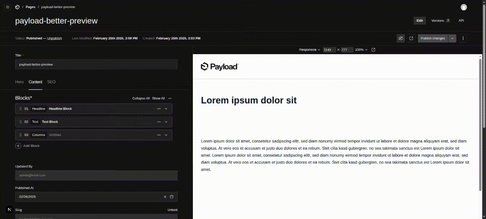

# payload-better-preview

Better live preview for [Payload CMS](https://payloadcms.com) — hover highlighting with block identification, bi-directional admin/preview sync, and smooth transitions.

## Features

### Hover Highlighting

Blue overlay marks the block under the cursor with a label badge showing block type, index, and name. Nested blocks get a dashed parent overlay with breadcrumb labels.



### Admin → Preview Sync

Click a block row in the admin editor — the preview scrolls to that block and highlights it with a flash effect.


### Preview → Admin Sync

Click a block in the preview — the admin editor scrolls to the corresponding block row, expands it if collapsed, and highlights it.


### Other

- **Draft-only** — Zero impact on published pages
- **Scroll/Resize tracking** — Overlay follows block position smoothly

## Installation

```bash
pnpm add github:scorpio-99/payload-better-preview
# or
npm install github:scorpio-99/payload-better-preview
```

### 1. Register the plugin

```ts
// payload.config.ts (or your plugins file)
import { betterPreview } from 'payload-better-preview'

export default buildConfig({
  plugins: [
    betterPreview(),
  ],
})
```

### 2. Add data attributes to block wrappers

The plugin expects these attributes on your block wrapper elements:

| Attribute | Required | Description |
|-----------|----------|-------------|
| `data-block` | Yes | Block type (e.g. `"headline"`, `"text"`) |
| `data-block-index` | No | 0-based index in the layout array |
| `data-block-name` | No | Optional block name |

Example:

```tsx
<div
  data-block={blockType}
  data-block-index={String(blockIndex)}
  data-block-name={blockName}
>
  {children}
</div>
```

### 3. Render `<PreviewToolbar />` in your page

Import the client component and render it conditionally in draft mode:

```tsx
import { PreviewToolbar } from 'payload-better-preview/client'

export default async function Page() {
  const { isEnabled: draft } = await draftMode()

  return (
    <>
      {draft && <LivePreviewListener />}
      {draft && <PreviewToolbar />}
      {/* ... rest of page */}
    </>
  )
}
```

## Configuration

```ts
betterPreview({
  disabled: false, // Set to true to disable the plugin
})
```

## How it works

`<PreviewToolbar />` is a `'use client'` component that renders `null` (no React DOM output). It injects 3 absolutely-positioned DOM elements into `document.body`:

1. **Overlay** — Primary block highlight (solid blue border)
2. **Parent Overlay** — For nested blocks (dashed border, subtle)
3. **Label** — Info badge with block type and index

All interaction is handled via event delegation on `document`, so it survives DOM updates from live preview re-renders.
